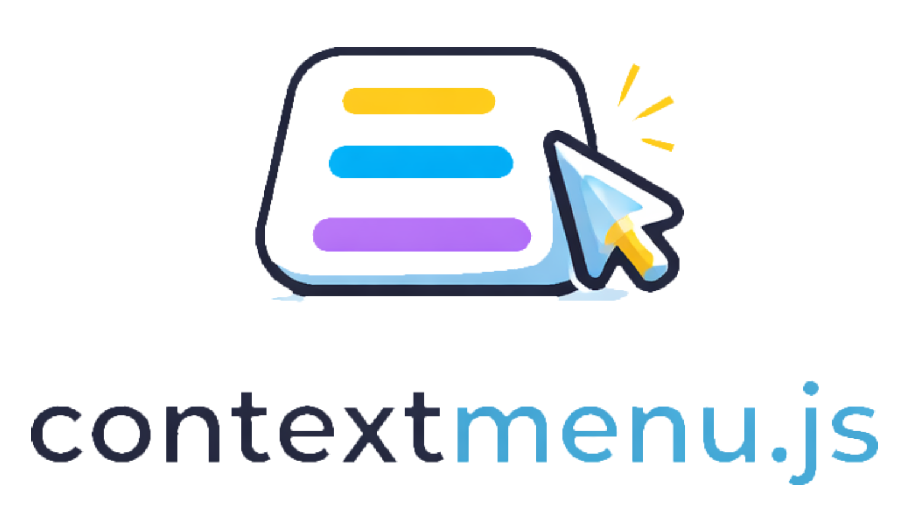

# contextmenu.js



A smooth, customizable context-menu library. TypeScript-first, framework-agnostic, with keyboard and screen-reader support.

## Install

```bash
npm install @enegalan/contextmenu.js
```

## Quick start

```js
import { createContextMenu } from "@enegalan/contextmenu.js";
import "@enegalan/contextmenu.js/dist/style.css";

const menu = createContextMenu({
  menu: [
    { label: "Copy", shortcut: "Ctrl+C", onClick: () => copy() },
    { label: "Paste", shortcut: "Ctrl+V", onClick: ({ close }) => { paste(); close(); } },
    { type: "separator" },
    { type: "submenu", label: "More", children: [
      { label: "Rename", onClick: () => rename() },
      { label: "Delete", onClick: () => remove() },
    ]},
  ],
});

// Open on right-click (desktop) or long-press (touch)
menu.bind(element);

// Or manually
element.addEventListener("contextmenu", (e) => { e.preventDefault(); menu.open(e); });

// Programmatic
const selected = await menu.open(x, y);
menu.close();
menu.open(button, { placement: "bottom-start" });
```

---

## Instance methods

What you get from `createContextMenu(config)`:

| Method | Description |
|--------|-------------|
| `open(xOrEventOrElement?, yOrOptions?)` | Show menu. No args: use `getAnchor` from config or (0,0). `(x, y)`: at coords. `(event)`: at event. `(element, options?)`: next to element (`placement`, `offset`). Returns `Promise<MenuItem \| undefined>`. |
| `close()` | Close the menu. Returns a `Promise<void>` when the close animation finishes. |
| `toggle(x?, y?)` | Open if closed, close if open. Optional `(x, y)` for open. |
| `getState()` | Returns `{ isOpen, anchor, menu, rootElement }` (menu is a copy). |
| `setMenu(menuOrUpdater)` | Set menu (array) or update with a function `(current) => newItems`. |
| `bind(element?, options?)` | Bind to element (right-click / long-press). Call `bind()` or `bind(null)` to unbind. `options.longPressMs`: delay (default 500). |
| `destroy()` | Remove menu and all listeners. |
| `setOptions(options)` | Update theme, position, animation, or `lockScrollOutside` at runtime. Only provided keys are applied. |

**setMenu with updater** — e.g. persist a checkbox:

```js
menu.setMenu((current) =>
  current.map((item) =>
    item.type === "checkbox" && item.label === "Dark mode"
      ? { ...item, checked: !item.checked }
      : item
  )
);
```

**setOptions example** — same shapes as in config:

```js
menu.setOptions({ theme: { class: "my-dark", tokens: { bg: "#1a1a1a", fg: "#eee" } } });
menu.setOptions({ position: { padding: 12, zIndexBase: 10000, submenuZIndexStep: 1 } });
menu.setOptions({ animation: { enter: 150, leave: 100 } });
menu.setOptions({ theme: undefined }); // clear theme
```

---

## Config options

What you pass to `createContextMenu({ ... })`:

| Option | Type | Description |
|--------|------|-------------|
| `menu` | `MenuItem[]` or `() => MenuItem[]` | The menu tree. If a function, it runs each time the menu opens (dynamic menu). |
| `submenuArrow` | `boolean` or object | `true` = default chevron SVG. Object: `{ icon?, size?, className?, opacity? }`; omit `icon` to use the CSS triangle. |
| `spinner` | `{ icon?, size?, speed? }` | Default loading spinner. `icon`: SVG string or HTMLElement. `size`: px or CSS length. `speed`: ms per full rotation (default 600). Overridable per item via `loadingIcon`, `loadingSize`, `loadingSpeed`. |
| `theme` | `{ class?, tokens? }` | `class`: CSS class on menu. `tokens`: e.g. `{ bg: "#111", fg: "#eee" }` (sets `--cm-bg`, `--cm-fg`). |
| `animation` | `{ type?, enter?, leave?, disabled? }` | `type`: `"fade"` (opacity + scale) or `"slide"` (opacity + translate). `enter` / `leave`: ms or `{ duration, easing }`. `disabled: true` = no animation. |
| `position` | `{ offset?, padding?, flip?, shift?, zIndexBase?, submenuZIndexStep? }` | `offset`: `{ x, y }`. `padding`: viewport padding (px). `flip` / `shift`: keep menu in view. `zIndexBase`: base z-index for root menu. `submenuZIndexStep`: increment per submenu level so each stacks above the previous (0 = no increment). |
| `portal` | `HTMLElement` or function | Where to mount the menu. Default: `document.body`. |
| `getAnchor` | `() => { x, y }` or `DOMRect` | Used when `open()` is called with no arguments (programmatic open at anchor). |
| `lockScrollOutside` | `boolean` | When `true` (default), prevent page scroll outside the menu while it is open (wheel/touchmove outside the menu are blocked). Set to `false` to allow background scrolling. |
| `submenuPlacement` | `"right"` \| `"left"` \| `"auto"` | Where to open submenus. `"auto"` uses RTL and viewport space (default). |
| `bind` | `HTMLElement` or `{ element, options? }` | Same as calling `menu.bind(element, options)` after create. |
| `onOpen` | `(event?: MouseEvent) => void` | Called when menu opens. `event` is set when opened by right-click or bind. |
| `onClose` | `(context?: CloseContext) => void` | Called when menu closes (after leave animation). `context`: `{ selectedItem?, anchor }`. |
| `onBeforeOpen` | `(event?, context?: OpenContext) => boolean \| void \| Promise<...>` | Called before opening. `context`: `{ x, y, target?, event? }`. Return `false` (or a Promise resolving to `false`) to cancel. |
| `onAfterClose` | `(context?: CloseContext) => void` | Called after the menu is fully closed (same context as `onClose`). |
| `onBeforeClose` | `() => boolean \| void \| Promise<...>` | Called before closing. Return `false` (or a Promise resolving to `false`) to cancel. |
| `onItemHover` | `(payload: { item, nativeEvent }) => void` | Called when the user hovers or focuses an interactive item. |
| `closeOnResize` | `boolean` | If `true`, menu closes on window resize. |
| `shortcutIcons` | `Record<string, string \| HTMLElement>` | Optional map of shortcut part names to SVG string or HTMLElement. Keys are the same names used in shortcuts (e.g. `ctrl`, `shift`, `enter`, `tab`, `cmd`, `alt`). When provided, those parts are rendered as icons instead of Unicode symbols (useful on Windows). Each icon is wrapped in a span with class `.cm-shortcut-icon` for styling. |
| `platform` | `"mac"` \| `"win"` \| `"auto"` | Override platform so the menu adapts to that OS (e.g. shortcut display). Default `"auto"` detects. Set to `"win"` on macOS to preview Windows look. |

---

## Menu item types

Each entry in `menu` (or in a submenu’s `children`) is one of these.

**Action** — clickable row

- `label` (string), `icon?`, `shortcut?`, `badge?` (string, number, or `BadgeConfig`: `{ content?, className?, render? }` for full control), `disabled?`, `loading?`, `variant?`, `onClick?`, `closeOnAction?`, `render?`
- `onClick` receives `{ item, nativeEvent, close }`. By default the menu closes on click; set `closeOnAction: false` to keep it open.
- `loading`: when `true`, shows a spinner and blocks interaction (use `setMenu` to clear). Optional: `loadingIcon` (SVG or HTMLElement), `loadingSize` (px or CSS length), `loadingSpeed` (ms per rotation) to override config.
- `variant`: `"default"` | `"danger"` | `"info"` | `"success"` | `"warning"` | `"muted"` (adds class e.g. `cm-item--danger`).

**Link** — navigation item

- `type: "link"`, `label`, `href`, optional `icon?`, `shortcut?`, `badge?` (string, number, or `BadgeConfig`), `target?` (e.g. `"_blank"`), `rel?` (e.g. `"noopener"`), `disabled?`, `loading?`, `variant?`, `className?`
- Renders as `<a>`. Ctrl/Cmd+click opens in new tab without preventing default.

**Submenu** — opens a nested menu

- `type: "submenu"`, `label`, `children` (array of items, or `() => MenuItem[]`, or `() => Promise<MenuItem[]>` for lazy loading), `icon?`, `shortcut?`, `badge?` (string, number, or `BadgeConfig`), `disabled?`, `variant?`, `submenuPlacement?`
- `children` as a function is resolved when the submenu opens (useful for async data).
- `submenuPlacement`: `"right"` | `"left"` | `"auto"` overrides the config for this submenu.
- Opens on hover or Arrow Right / Enter.

**Separator**

- `type: "separator"` (optional `id`, `className`).

**Checkbox**

- `type: "checkbox"`, `label`, `checked?`, `onChange?`, plus `leadingIcon?`, `shortcut?`, `icon?` / `uncheckedIcon?`, `disabled?`, `loading?`, `closeOnAction?`, `variant?`, `render?`
- `onChange` receives `{ item, checked, nativeEvent, close }`. State is not stored; use a function menu or `setMenu` (with updater) to persist.

**Radio**

- `type: "radio"`, `label`, `name`, `value`, `checked?`, `onSelect?`, plus same optional props as checkbox (including `loading?`).
- One item per group (same `name`) should have `checked: true`. Update menu to reflect selection.

**Label** — non-clickable header

- `type: "label"`, `label` (string), optional `id`, `className`.

**Custom events**

Every menu item has an optional `events` property: `EventRegistry | (() => EventRegistry)`. `EventRegistry` is a map of DOM event names to either a listener function or an object `{ listener, options? }` (where `options` is `EventListenerOptions`, e.g. `{ passive: true }`). Handlers are attached to the item’s DOM element.

```js
{
  label: "Hover here!",
  events: {
    mouseenter: (e) => { e.target.style.animation = "blinker 1s linear infinite"; },
    mouseleave: {
      listener: (e) => { e.target.style.animation = ""; },
      options: { passive: true }
    }
  }
}
```

---

## Shortcut display (symbols)

The `shortcut` string is shown next to the item. Use the names below so the library can render **modifier** and **key** symbols (e.g. ⌘↵ instead of "Cmd+Enter"). Names are **case-insensitive**.

**Format:** `Modifier+Modifier+Key` — use `+` to separate parts. The last segment is the key; the rest are modifiers.

**Modifiers** (display depends on platform):

| You write | macOS / iOS display | Windows / Linux display |
|-----------|---------------------|--------------------------|
| `Ctrl`    | ⌘ (shown as Cmd)    | ⌃                        |
| `Cmd`     | ⌘                    | Win icon                 |
| `Alt`     | ⌥                    | ⎇                        |
| `Shift`   | ⇧                    | ⇧                        |
| `Win` / `Windows` | ⌘ (as Cmd)   | Win icon                 |

**Keys** (use these exact names to get symbols):

| You write     | Display |
|---------------|---------|
| `Enter` / `Return` | ↵   |
| `Tab`         | ⇥       |
| `Backspace`   | ⌫       |
| `Escape` / `Esc` | ⎋    |
| `Delete`      | ⌦       |
| `Space`       | ␣       |
| `Left` / `Right` / `Up` / `Down` (or `ArrowLeft`, etc.) | ← → ↑ ↓ |
| `Home` / `End` | ⇱ ⇲    |
| `PageUp` / `PageDown` | ⇞ ⇟ |
| `Insert` / `Ins` | ⎀     |

Single letters and other keys (e.g. `C`, `F1`) are shown as-is (letters in uppercase). Examples:

- `"Ctrl+C"` → ⌘C (Mac) or ⌃C (Win)
- `"Ctrl+Shift+Enter"` → ⌘⇧↵ (Mac) or ⌃⇧↵ (Win)
- `"Alt+Tab"` → ⌥⇥ (Mac) or ⎇⇥ (Win)

**Using SVG/icons instead of symbols**

To use icons for other shortcut parts (e.g. when symbols don’t render well), pass `shortcutIcons` in the config. On Windows the Win key uses a built-in SVG icon by default. Keys must match the shortcut part names (lowercase): `ctrl`, `shift`, `alt`, `cmd`, `win`, `enter`, `tab`, `escape`, etc.

```js
createContextMenu({
  menu: [...],
  shortcutIcons: {
    ctrl: '<svg viewBox="0 0 24 24">...</svg>',
    shift: '<svg viewBox="0 0 24 24">...</svg>',
    enter: '<svg viewBox="0 0 24 24">...</svg>',
    tab: '<svg viewBox="0 0 24 24">...</svg>',
  },
});
```

Each icon is wrapped in a span with class `.cm-shortcut-icon` so you can size or style them in CSS.

---

## Theming

Load the default CSS and override with variables:

```css
@import "@enegalan/contextmenu.js/dist/style.css";

.cm-menu {
  --cm-bg: #1e1e1e;
  --cm-fg: #eee;
  --cm-radius: 8px;
}
```

Or pass `theme` when creating the menu:

```js
createContextMenu({
  menu: [...],
  theme: { class: "my-menu", tokens: { bg: "#1e1e1e", fg: "#eee" } },
});
```

**Core variables (in default CSS):** `--cm-bg`, `--cm-fg`, `--cm-radius`, `--cm-shadow`, `--cm-font-size`, `--cm-z-index`, `--cm-border`, `--cm-menu-padding`, `--cm-item-padding`, `--cm-enter-duration`, `--cm-leave-duration`, `--cm-enter-easing`, `--cm-leave-easing`. Override these on `.cm-menu` or scope them with `theme.class` for per-menu styling.

**Escape hatch:** For full control (badge, shortcut, spinner, variants), style the classes directly: `.cm-item-badge`, `.cm-shortcut`, `.cm-spinner`, `.cm-item--danger`, `.cm-item--info`, etc. Use `theme.class` when creating the menu to scope your own CSS (e.g. custom variables) to that menu.

**Animation:** Config `animation` (or `setOptions({ animation })`) can set enter/leave times and `type: "slide"`. The same variables are applied via CSS when the lib sets them.

**Badge:** Items with `badge` render a pill (`.cm-item-badge`). Use a string/number or `BadgeConfig`: `{ content?, className? }` or `{ render: () => HTMLElement }`. Style `.cm-item-badge` with your own CSS if you need more than the default look.

---

## Singleton behavior

Only one context menu is open at a time. When a new menu is opened (from any instance created with this library), any other open menu is closed first.

---

## Accessibility

- **ARIA:** Root `role="menu"`, items `menuitem` / `menuitemcheckbox` / `menuitemradio`, submenus `aria-haspopup` and `aria-expanded`, separators `separator`, labels `presentation`.
- **Keyboard:** Arrows (move, open/close submenu), Enter/Space (activate), Escape (close), Home/End (first/last). **Shortcuts:** With the menu open, pressing an item’s shortcut (e.g. `Ctrl+C` or `Cmd+C`) runs that item; Ctrl and Cmd are treated as equivalent (macOS and Windows/Linux). Focus returns to trigger on close.
- **Focus:** Roving tabindex on the menu.

---

## Bundle size

Build output is minified. Approximate sizes:

| Asset | Size |
|-------|------|
| `dist/index.js` (ESM) | ~29 KB |
| `dist/index.cjs` (CJS) | ~30 KB |
| `dist/style.css` | ~8 KB (minified) |

---

## Build

```bash
npm install
npm run build
```

Output: `dist/index.js` (ESM), `dist/index.cjs` (CJS), `dist/index.d.ts`, `dist/style.css` (minified).

**Dev + example:**

```bash
npm run dev
```

---

## License

MIT
